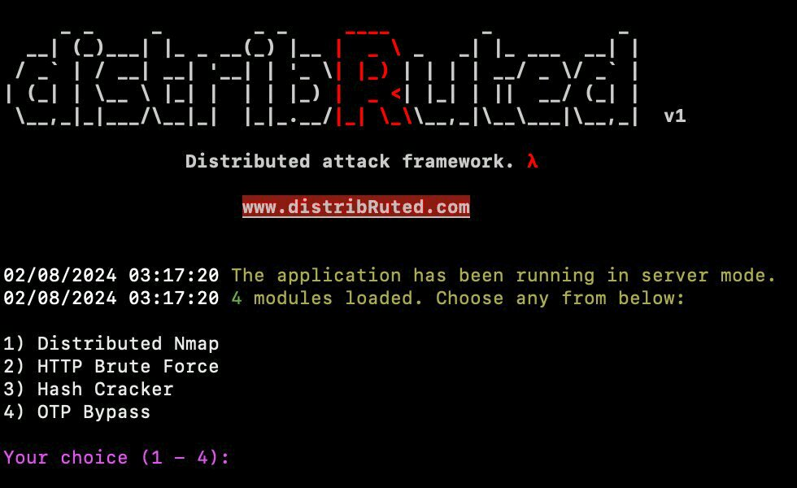

**The source code will be released very soon. Stay tuned! 👀**

[Please follow us on X to keep up with the latest updates and newly released distributed attack modules.](https://x.com/distribRuted)

## What is distribRuted? 🤔
Penetration testing tools often face limitations such as IP blocking, insufficient computing power, and time constraints. However, by executing these tests across a distributed network of hundreds of devices, these challenges can be overcome. Organizing such a large-scale attack efficiently is complex, as the number of nodes increases, so does the difficulty in orchestration and management. distribRuted provides the necessary infrastructure and orchestration for distributed attacks. This framework allows developers to easily create and execute specific distributed attacks using standard application modules. Users can develop their attack modules or utilize pre-existing ones from the community. With distribRuted, automating, managing, and tracking a distributed attack across hundreds of nodes becomes straightforward, thereby enhancing efficiency, reducing time and costs, and eliminating Single Point of Failure (SPoF) in penetration testing.

## How Can You Contribute? 💡
We believe that old testing approaches should now be replaced by more effective distributed attacks. **distribRuted** is a tool that can provide the necessary infrastructure and orchestration for any distributed attack and workflow. To enable more attack methods to become distributed, more application modules need to be developed in the framework standard. Become a part of our community, and let's evolve the internet together!

We especially need your help in the following areas:

-   Creating a wiki page that explains the framework standards 📚
-   Developing new application modules (like distributed Nmap, OTP Spraying, brute force modules...) 💻
-   Writing content that includes write-ups how/where distribRuted is used ✍️
-   Reporting any bugs you find in the framework 🐛
-   Submitting improvements/developments that will strengthen the framework 🔧

## Contact
You can send us a DM on X or email our developers!
- [distribRuted (@distribRuted) / X](https://x.com/distribRuted)
- root@numanozdemir.com
